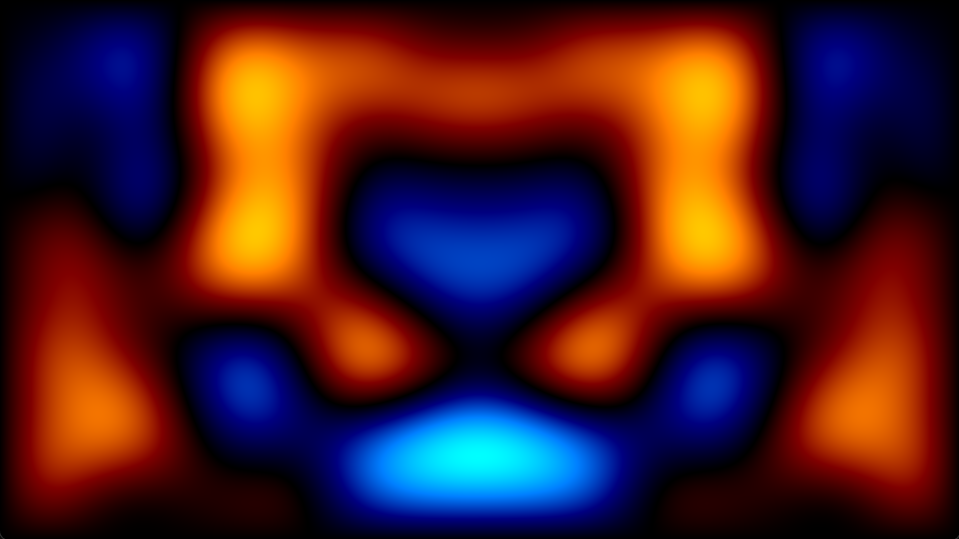
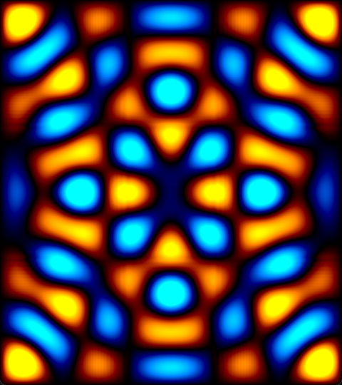

# WaveSimulation
A pretty and interactive simulation of the wave equation.

This program displays a wave evolving in real time according to the wave equation. You can click and drag to add to the wave, or right click to add a small concentrated point to the wave. Press Q to invert the amplitude of the waves you create with the mouse, and press Esc to close the window. This project uses SFML to create a window and draw to it, and Eigen for linear algebra including convolutions and FFT.

This project won't bulid with just what's in this repo. That's why I've included Windows binaries in `bin` in case you want to try it out. If anyone is interested in building this project, please let me know and I'll refactor it for you :)
